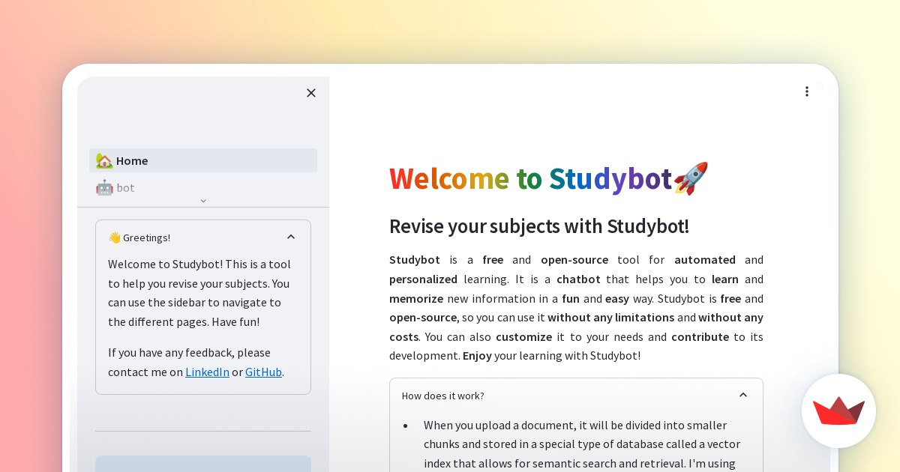
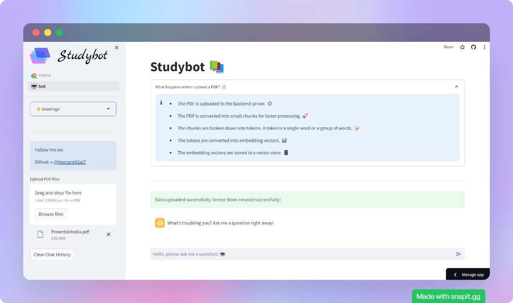
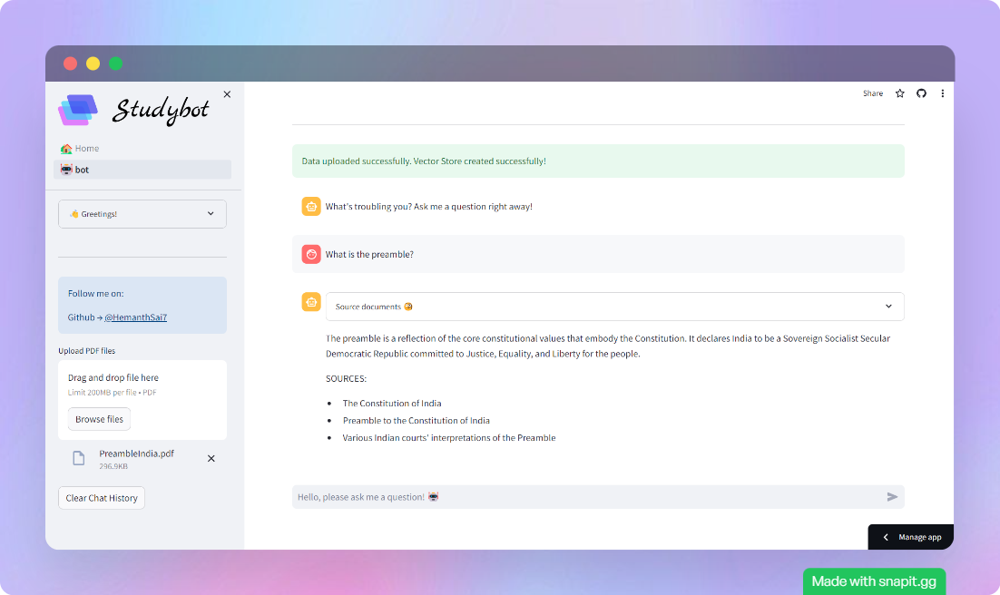

# StudyBot x Streamlit

✨ Streamlit is an open-source app framework for Machine Learning and Data Science teams. Create beautiful data apps in hours, not weeks. All in pure Python. ✨

## Motive
When studying a theoretical subject, which has a lot of concepts, dates, important events etc. No matter how hard we try to memorise them, it's hard to remember them all. So, I thought of making a bot that can help us in quick revision of the subject. For example, if we are studying history, and we forget the event of the 1857 revolt, we can ask the bot like **"What happened in 1857?"** and it will tell us the brief answer. This will help us in quick revision of the subject.

## Backend (FastAPI)

#### Installation

```bash
pip install -r requirements.txt
```

#### Folder Structure

> - `StudybotAPI/backend` contains the backend code for the API.
> - `StudybotAPI/backend/app.py` contains the FastAPI code for the API.
> - `StudybotAPI/backend/core` contains the code for configuring environment variables and custom logging.
> - `StudybotAPI/backend/schema` contains the Pydantic models for the API.
> - `StudybotAPI/backend/utils` contains the utility functions for the API.
> - `StudybotAPI/backend/ingestion` contains the code for ingesting data from the database.
> - `StudybotAPI/backend/retriever` contains the code for retrieval of the answer from the database.

#### Start development server

Run the following command:

```bash
cd StudybotAPI
uvicorn app:app --reload
```
Now go to [http://127.0.0.1:8000]([http://127.0.0.1:8000) to access `Swagger UI`.

## Frontend (Streamlit)

#### Installation

```bash
pip install -r requirements.txt
```

#### Folder Structure
> - `frontend/components/*` contains the code for the components of the frontend.
> - `frontend/images/*` contains the images used in the frontend.
> - `frontend/🏡_home.py` contains the code for the homepage of the frontend.
> - `frontend/layouts/*` contains the code for the layouts of the frontend.
> - `frontend/pages/*` contains the code for the pages of the frontend.


#### Start development server

Run the following command:

```bash
cd frontend
streamlit run '🏡_home.py'
```

Now go to [http://localhost:8501](http://localhost:8501) and start chatting with your bot! The bot will automatically reload when you change the code.


## How to use
Input the question in the text box and press enter. The bot will give you the answer. If you want to ask another question, just enter the question and the bot will try to answer.

## Screenshots




## How it works


## Tech Stack


